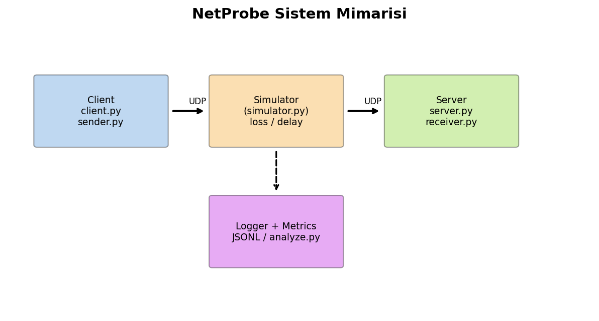
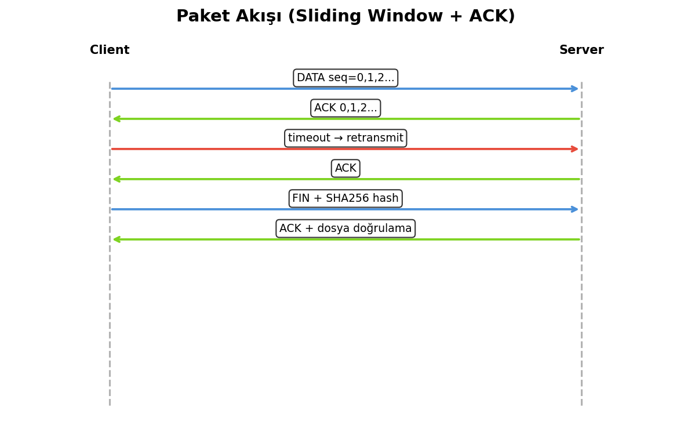

# NetProbe — Teknik Rapor

**UDP Tabanlı Güvenilir Dosya Aktarımı, Trafik İzleme ve Ağ Performans Analiz Platformu**

| | |
|---|---|
| **Üniversite** | Bursa Teknik Üniversitesi |
| **Bölüm** | Bilgisayar Mühendisliği |
| **Ders** | Bilgisayar Ağları — Dönem Projesi |
| **Proje** | NetProbe |

---

## İçindekiler

1. [NetProbe Nedir? Ne İşe Yarar?](#1-netprobe-nedir-ne-işe-yarar)
2. [Nasıl Kullanılır?](#2-nasıl-kullanılır)
3. [Sistem Mimarisi](#3-sistem-mimarisi)
4. [Çalışma Mantığı](#4-çalışma-mantığı)
5. [Protokol Tasarımı](#5-protokol-tasarımı)
6. [Güvenilirlik Mekanizmaları](#6-güvenilirlik-mekanizmaları)
7. [Loglama ve Metrikler](#7-loglama-ve-metrikler)
8. [Deneyler ve Sonuçlar](#8-deneyler-ve-sonuçlar)
9. [Sorunlar ve Çözümler](#9-sorunlar-ve-çözümler)
10. [Sonuç](#10-sonuç)

> **PDF sürümü:** `docs/NetProbe_Rapor.pdf` — grafikler ve diyagramlar dahil  
> Oluşturmak için: `python scripts/generate_report_pdf.py`

---

## 1. NetProbe Nedir? Ne İşe Yarar?

### 1.1 Tanım

**NetProbe**, UDP (User Datagram Protocol) üzerinde çalışan; ancak TCP'nin sağladığı **güvenilirlik, sıralama ve hata kontrolü** mekanizmalarını **uygulama katmanında kendisi tasarlayan** bir dosya aktarım ve ağ analiz platformudur.

UDP doğası gereği:
- Bağlantı kurmaz
- Paket sırası garanti etmez
- Kayıp paketi otomatik yeniden göndermez

NetProbe bu eksiklikleri **sequence number, ACK, timeout, retransmission, checksum ve hash** ile giderir.

### 1.2 Ne İşe Yarar?

| Amaç | Açıklama |
|------|----------|
| **Eğitim** | UDP vs TCP farkını uygulamalı görmek |
| **Protokol tasarımı** | Basit bir uygulama katmanı protokolü geliştirmek |
| **Trafik analizi** | Her paket olayını JSONL ile kaydetmek |
| **Performans ölçümü** | Throughput, goodput, RTT, retransmit oranı hesaplamak |
| **Deneysel analiz** | Paket boyutu, timeout, kayıp oranı etkisini test etmek |

### 1.3 Kimler İçin?

- Bilgisayar Ağları dersi öğrencileri (dönem projesi teslimi)
- Ağ protokolü mantığını kod üzerinden öğrenmek isteyenler
- Kontrollü dosya transferi deneyi yapmak isteyen geliştiriciler

---

## 2. Nasıl Kullanılır?

### 2.1 Kurulum

```bash
cd netprobe
pip install -r requirements.txt
export PYTHONPATH=src
```

### 2.2 Temel Dosya Aktarımı (Kayıpsız)

**Terminal 1 — Sunucu başlat:**
```bash
python src/server.py --port 9001 --out-dir received/
```

**Terminal 2 — Dosya gönder:**
```bash
python src/client.py --host 127.0.0.1 --port 9001 --file /yol/dosya.bin
```

Başarılı aktarımda:
- Client: `Transfer complete` mesajı
- Server: `File saved: received/dosya.bin` + hash doğrulama

### 2.3 Simülatör ile Kayıplı Aktarım

Localhost gerçek paket kaybı üretmez; bu yüzden **simülatör zorunludur**:

```bash
# T1: Proxy (%5 kayıp)
python src/simulator.py --listen 9000 --forward 9001 --loss-rate 0.05

# T2: Sunucu
python src/server.py --port 9001

# T3: İstemci (proxy'ye bağlan)
python src/client.py --port 9000 --file dosya.bin
```

### 2.4 Otomatik Deney ve Grafik

```bash
python scripts/run_experiment.py --config experiments/configs/scenario_a_chunk_1024.json
python src/analyze.py
python scripts/generate_report_pdf.py   # PDF rapor
```

### 2.5 CLI Parametreleri

| Parametre | Varsayılan | Açıklama |
|-----------|------------|----------|
| `--chunk-size` | 1024 | Dosya parça boyutu (byte) |
| `--timeout` | 1000 | ACK bekleme süresi (ms) |
| `--window` | 8 | Sliding window boyutu |
| `--max-retries` | 5 | Paket başına max yeniden gönderim |

---

## 3. Sistem Mimarisi

```
┌─────────────┐     UDP       ┌──────────────┐     UDP       ┌─────────────┐
│   CLIENT    │ ────────────► │  SIMULATOR   │ ────────────► │   SERVER    │
│ client.py   │               │ (opsiyonel)  │               │ server.py   │
│ sender.py   │ ◄──────────── │ simulator.py │ ◄──────────── │ receiver.py │
└──────┬──────┘     ACK       └──────────────┘     ACK       └──────┬──────┘
       │                                                            │
       ▼                                                            ▼
  logger.py / metrics.py                                     received/ dosya
       │
       ▼
  analyze.py → grafikler + PDF
```



### Modüller

| Dosya | Görev |
|-------|-------|
| `protocol.py` | Paket encode/decode, CRC32 |
| `sender.py` | Sliding window gönderici |
| `receiver.py` | Selective repeat alıcı |
| `logger.py` | JSONL olay kaydı |
| `metrics.py` | Performans metrikleri |
| `simulator.py` | Kayıp/gecikme proxy |
| `analyze.py` | Grafik üretimi |

---

## 4. Çalışma Mantığı

### 4.1 Aktarım Adımları

1. **Hazırlık:** Client dosyayı okur, SHA256 hash hesaplar, chunk'lara böler.
2. **Gönderim:** Sliding window ile DATA paketleri UDP üzerinden gönderilir.
3. **Onay:** Server her geçerli paket için ACK döner.
4. **Kayıp:** Timeout olursa client aynı paketi yeniden gönderir (max 5 kez).
5. **Duplicate:** Server tekrar gelen seq için ACK verir ama diske yazmaz.
6. **Bitiş:** Client FIN paketi (hash + dosya adı) gönderir.
7. **Doğrulama:** Server dosyayı birleştirir, hash karşılaştırır.



### 4.2 Sliding Window (Bonus)

Stop-and-wait'te her paket için bir RTT beklenir. **Window=8** ile aynı anda 8 paket uçuşta olabilir; verim artar.

```
base = ilk onaylanmamış seq
Gönder: seq ∈ [base, base + window)
ACK gelince base ilerler
```

### 4.3 Selective Repeat (Alıcı)

Sıra dışı gelen paketler buffer'da tutulur; sadece `base` seq onaylandığında pencere kayar. Duplicate'ler atılır.

---

## 5. Protokol Tasarımı

### DATA / FIN Başlığı (16 byte)

| Alan | Boyut | Açıklama |
|------|-------|----------|
| type | 1 | 1=DATA, 3=FIN |
| seq | 4 | Sıra numarası |
| total_pkts | 4 | Toplam paket |
| payload_len | 2 | Payload uzunluğu |
| checksum | 4 | CRC32 |
| reserved | 1 | 0 |

### ACK (9 byte)

| type | ack_num | checksum |

Detay: `docs/protocol.md`

---

## 6. Güvenilirlik Mekanizmaları

| Mekanizma | Uygulama |
|-----------|----------|
| Sequence number | Her chunk numaralı |
| ACK | Her başarılı DATA için |
| Timeout | `select()` + zaman aşımı |
| Retransmit | Max **5** deneme (föy gereksinimi) |
| Duplicate | ACK tekrar, yazma yok |
| Bütünlük | SHA256 (FIN paketinde) |
| Hata | ERR paketi + log + stderr |

---

## 7. Loglama ve Metrikler

### Olay Türleri (JSONL)

`send`, `ack_received`, `timeout`, `retransmit`, `transfer_complete`, `error`, `duplicate`

### Metrik Tanımları

- **Goodput (bps):** `file_bytes × 8 / completion_time_s`
- **Throughput (bps):** Bu projede goodput ile aynı tanım
- **Retransmission rate:** `retransmits / packets_sent`
- **Packet loss rate:** `timeouts / packets_sent` (yaklaşık)

Örnek log:
```json
{"t": 1716200000.12, "event": "send", "seq": 3, "bytes": 1024}
{"t": 1716200000.24, "event": "ack_received", "seq": 3, "rtt_ms": 122.5}
```

---

## 8. Deneyler ve Sonuçlar

**11 senaryo × 3 tekrar** çalıştırıldı. Özet tablo ve 10 grafik `docs/NetProbe_Rapor.pdf` içinde.

### Senaryo A — Paket Boyutu (512 KB, kayıpsız)

| Chunk | Tamamlanma (s) | Paket sayısı |
|-------|----------------|--------------|
| 256 B | ~0.17 | ~2049 |
| 1024 B | ~0.045 | ~513 |
| 4096 B | ~0.02 | ~129 |

### Senaryo B — Timeout (%5 kayıp, 1 MB)

| Timeout | Tamamlanma (s) |
|---------|----------------|
| 200 ms | ~10 s |
| 500 ms | ~11 s |
| 2000 ms | ~12 s |

### Senaryo C — Kayıp Oranı (1 MB)

| Kayıp | Tamamlanma | Retrans. |
|-------|------------|----------|
| 0% | ~1 s | 0 |
| 5% | ~46 s | ~4.9% |
| 15% | yüksek | artar |

### Senaryo D — Dosya Boyutu

| Dosya | Tamamlanma |
|-------|------------|
| 100 KB | ~0.01 s |
| 5 MB | ~0.4 s |

Grafikler: `docs/report_assets/fig03` … `fig10`, `experiments/results/charts/`

PDF yenileme: `python scripts/generate_report_pdf.py`

---

## 9. Sorunlar ve Çözümler

| Sorun | Çözüm |
|-------|-------|
| localhost'ta kayıp yok | UDP simülatör proxy |
| Out-of-order ACK | Selective repeat + base pointer |
| Goodput tanımı belirsizliği | Raporda tek cümleyle sabitlendi |
| %15 kayıpta transfer fail | Beklenen; timeout/retry artırılabilir |

---

## 10. Sonuç

NetProbe, UDP üzerinde güvenilir dosya aktarımını başarıyla gerçekleştirir; trafik olaylarını loglar ve performans metriklerini deneysel olarak analiz eder. Föy gereksinimlerinin yanı sıra sliding window, kayıp simülatörü ve görselleştirme paneli (bonus) eklenmiştir.

**Teslim paketi:** `netprobe/` kaynak kod + `docs/NetProbe_Rapor.pdf` + deney logları + README (GitHub linki)

---

*Rapor PDF: `python scripts/generate_report_pdf.py`*
